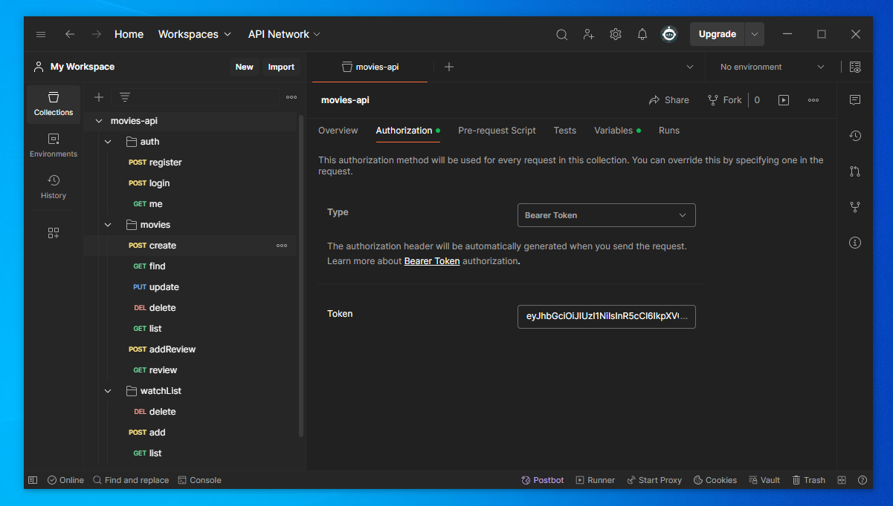

 

# Movie API

This project is a Node.js/Express backend API for managing movies, including user authentication, movie reviews, and watchlists. It is designed to be a standalone, professional-grade API suitable for production use.

## Table of Contents

- [Features](#features)
- [Installation](#installation)
- [Usage](#usage)
- [API Endpoints](#api-endpoints)
- [Models](#models)
- [Middleware](#middleware)
- [Contributing](#contributing)
- [License](#license)

## Features

- User authentication (registration and login)
- JWT-based authentication
- Admin and user roles
- CRUD operations for movies
- User watchlists
- Movie reviews and ratings
- Pagination for movie listings

## Installation

1. Clone the repository:
    ```bash
    git clone https://github.com/engineermamoun/movies-api.git
    cd movie-api
    ```

2. Install dependencies:
    ```bash
    npm install
    ```

3. Set up environment variables:
    Create a `.env` file in the root directory and add the following:
    ```env
    PORT=4000
    DB_URL=mongodb://localhost:27017/movies-api
    JWT_SECRET=super-secret-movies-app
    JWT_EXPIRES_IN=1h
    ```

    **Note:** Do not push the `.env` file to the repository as it contains sensitive information.

4. Start the server:
    ```bash
    npm run start:dev
    ```

## Usage

### Running the Server

To start the server, run:
```bash
npm run start:dev
```

The server will start on `http://localhost:4000`.

### API Endpoints

#### Authentication

- **POST /api/auth/register**: Register a new user
- **POST /api/auth/login**: Login a user
- **GET /api/auth/me**: Get authenticated user's details

#### Movies

- **POST /api/movies**: Create a new movie (Admin only)
- **GET /api/movies**: Get all movies (with pagination)
- **GET /api/movies/:id**: Get a movie by ID
- **PUT /api/movies/:id**: Update a movie by ID (Admin only)
- **DELETE /api/movies/:id**: Delete a movie by ID (Admin only)
- **POST /api/movies/:id/reviews**: Add a review to a movie
- **GET /api/movies/:id/reviews**: Get all reviews for a movie

#### Watchlist

- **POST /api/watchlist**: Add a movie to the watchlist (Admin only)
- **DELETE /api/watchlist/:movie**: Remove a movie from the watchlist (Admin only)
- **GET /api/watchlist**: Get the user's watchlist

## Models

### User

- `name`: String, required, max length 50
- `email`: String, required, unique
- `password`: String, required
- `watchList`: Array of objects containing `movie` (reference to Movie) and `watched` (Boolean)
- `isAdmin`: Boolean, default false

### Movie

- `name`: String, required
- `category`: String, required
- `description`: String, required
- `rate`: Number, default 0
- `review`: Array of objects containing `user` (reference to User), `comment` (String), and `rate` (Number)

## Middleware

### Authentication Middleware

- **auth.check**: Verifies the JWT token and attaches the user ID to the request object.

### Admin Middleware

- **admin.check**: Checks if the authenticated user is an admin.

## Contributing

Contributions are welcome! Please fork the repository and submit a pull request for any changes.

 

 